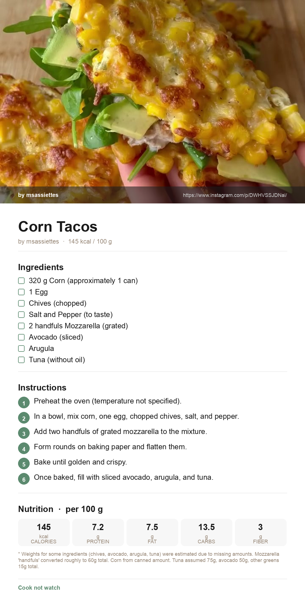

# Cook not watch 🍳

> Turn TikTok and Instagram recipe videos into clean, printable recipe cards — automatically.

**Built with:** FastAPI · OpenAI GPT-4o Vision · yt-dlp · Pillow · Python


<!-- Replace with your own screenshot or GIF -->

---

## What it does

Paste a TikTok or Instagram link (or upload a screenshot / paste text) → get a structured recipe with ingredients, steps, and macros (КБЖУ), ready to download as a **PNG card** or **PDF**.

- Extracts recipes from video links, screenshots, or raw text
- Calculates nutrition per 100 g: calories, protein, fat, carbs, fiber
- Downloads as a Pinterest-style image card or A4 PDF
- Bilingual UI: English / Russian

---

## Tech stack

| Layer | Technology |
|---|---|
| Backend | FastAPI + Uvicorn |
| AI | OpenAI GPT-4o Vision (video frames) · gpt-4.1-mini (text + nutrition) |
| Video download | yt-dlp + ffmpeg |
| Image generation | Pillow |
| PDF generation | ReportLab |
| Deployment | Railway (Nixpacks) |

---

## Quick start

```bash
# 1. Clone
git clone https://github.com/svetlandia-ai/cook-not-watch.git
cd cook-not-watch

# 2. Create virtual environment
python -m venv .venv
source .venv/bin/activate   # Windows: .venv\Scripts\activate

# 3. Install dependencies
pip install -r requirements.txt

# 4. Add your OpenAI key
cp .env.example .env
# Edit .env and paste your key: OPENAI_API_KEY=sk-...

# 5. Run
uvicorn app.main:app --reload

# 6. Open in browser
open http://127.0.0.1:8000/app
```

> **Note:** ffmpeg must be installed on your system.
> Mac: `brew install ffmpeg` · Linux: `sudo apt install ffmpeg`

---

## Optional: better fonts

For a higher-quality PNG card, download [Inter](https://fonts.google.com/specimen/Inter) from Google Fonts and place the files here:

```
app/assets/fonts/Inter-Regular.ttf
app/assets/fonts/Inter-Bold.ttf
```

The app falls back to system fonts automatically if these are not present.

---

## Deploy to Railway

1. Push this repo to GitHub
2. Create a new project at [railway.app](https://railway.app)
3. Connect your GitHub repo
4. Add environment variable: `OPENAI_API_KEY`
5. Railway will auto-detect `nixpacks.toml` and install ffmpeg

---

## API endpoints

| Method | Path | Description |
|---|---|---|
| `GET` | `/app` | Web UI |
| `POST` | `/extract-from-video` | Extract recipe from video URL |
| `POST` | `/extract-from-image` | Extract recipe from uploaded image |
| `POST` | `/extract-from-text` | Extract recipe from text |
| `POST` | `/generate-card` | Generate PNG recipe card |
| `POST` | `/generate-pdf` | Generate PDF recipe card |

---

## About

Built by **[Svetlana Ivanova]** · [www.linkedin.com/in/svetlanai](https://your-portfolio.com) · [LinkedIn](https://linkedin.com/in/yourprofile)

This project was built as part of my portfolio to demonstrate full-stack AI application development with Python and OpenAI APIs.
